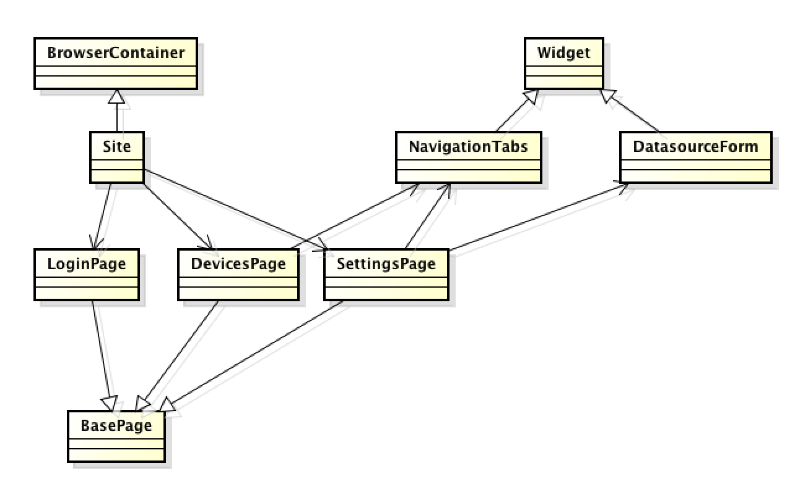

0. `pip install -r requirements.txt` 以安装依赖

# API 版本说明

1. 涉及 3 个 api, 两个是 rpc api, 一个是 rest api

```
https://qacandidate1.logicmonitor.com/santaba/rpc/signIn
https://qacandidate1.logicmonitor.com/santaba/rest/setting/datasources
https://qacandidate1.logicmonitor.com/santaba/rpc/getDataSourceInstances
```

2. rpc api 可以用 cookie 进行验证, 而 python 的 requests 库使用其 Session 类同一实例连续请求可以类似浏览器一般自动维护 cookie. 所以先请求 signIn 得到 cookie, 后续 rpc 接口直接访问即可

3. post 请求用 json 参数可以, 发送 application/json 的 body

4. 使用其提供的 HTTPBasicAuth 进行基本 http 认证


## 改进点:
url 获取可以抽象化. 做成类似:
```
LMApi(account).rpc.signIn  # https://qacandidate1.logicmonitor.com/santaba/rpc/signIn
LMApi(account).rest.setting.datasource # https://qacandidate1.logicmonitor.com/santaba/rest/setting/datasources
```

P.S. datasource 的 api 在 rest api 文档里没有


# e2e selenium 版本说明

1. 设计模式 Page Object

2. 下面是类图



3. Widgets 是页面最小单位, 可以是表单, 导航栏, 菜单 或 其它异步刷新的部件.  元素定位基本在这一层

4. Page 是就是对应页面, 有确定的 url 路径, 包含一些固定的页面元素, 业务逻辑在这一层, 也有少量元素定位

5. 不同的页面可以拥有相同的部件, 例如导航栏

6. Site 就是整个站点, 有所有页面信息, 可以直接跳转到对应页面


## 改进点
time.sleep 可以换成更合适时等待方式.
